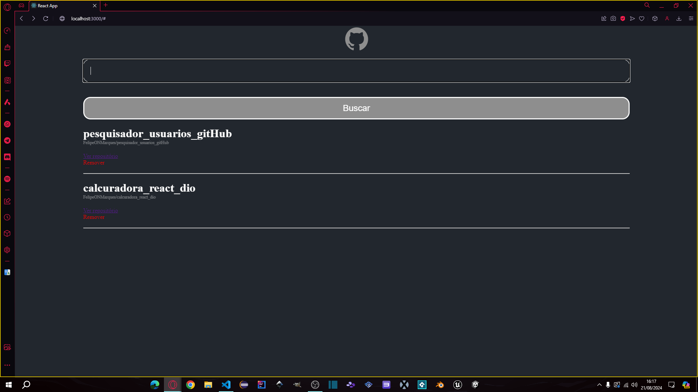
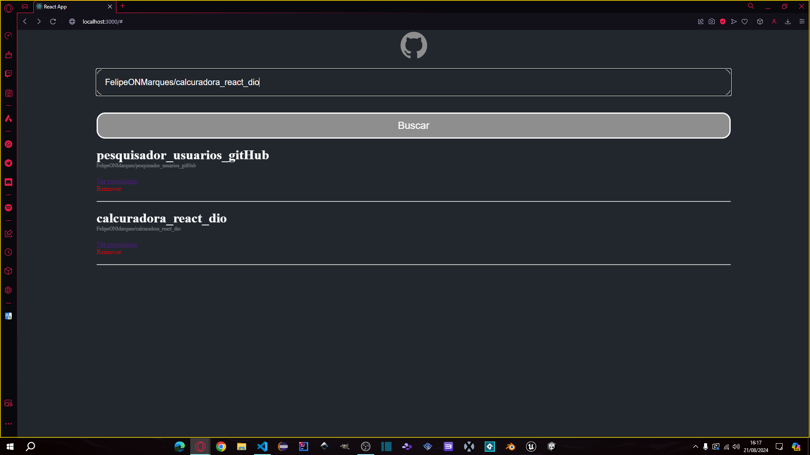

# Criando Uma Wiki de Repositórios do GitHub Com React

O objetivo desse projeto é criar um pesquisador de repositórios públicos pesquisando o nome de usuário e repositório desejado.

## Tecnologias Utilizadas

* JavaScript
* React
* StyledComponents
